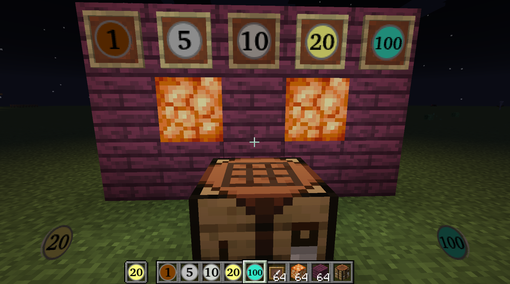
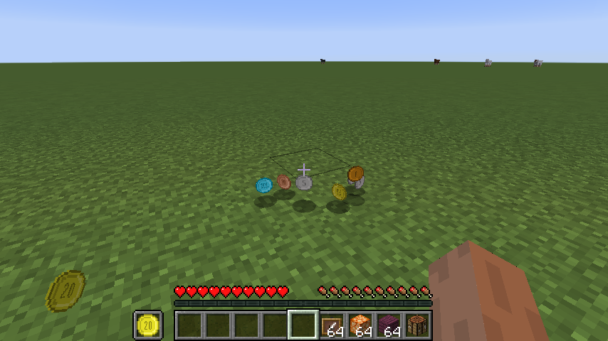
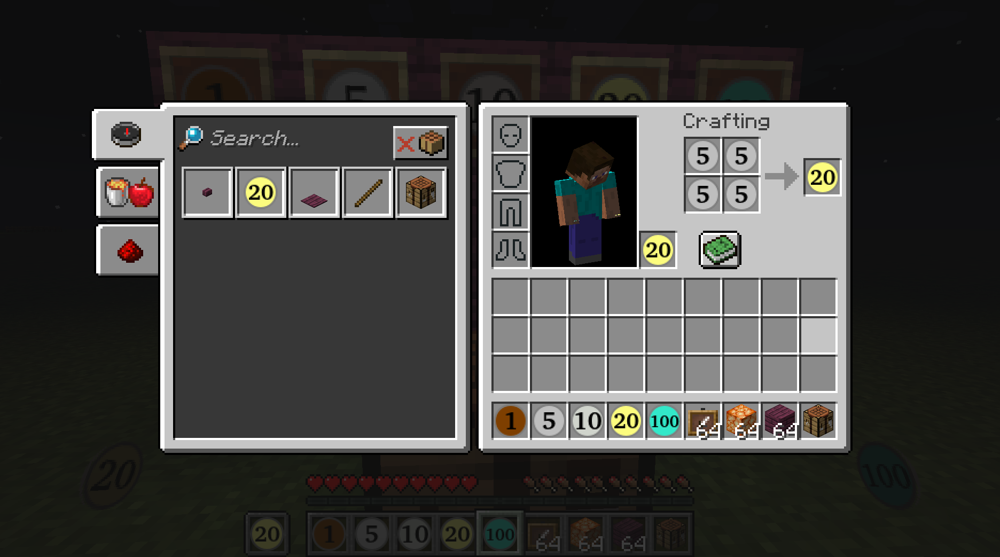

# Minecraft mod

Adds 5 coins to the game, with the values 1, 5, 10, 20, 100.

Also add crafting recipts to join or split the coins, like making two fives in to one ten.

Coins in itemframes:

Coins on the ground:

Crafting coins:
